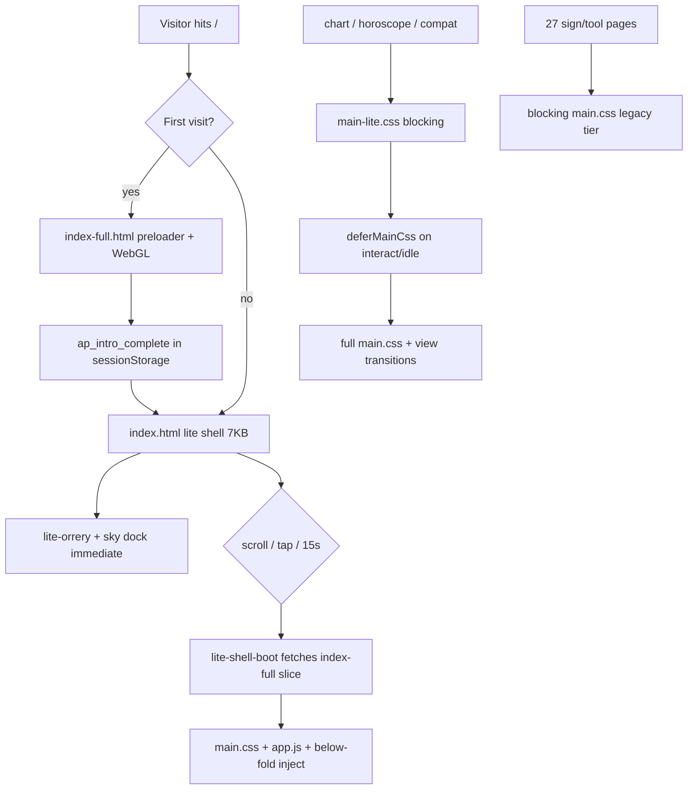

# AstroPrecise — Multi-Agent Site Audit (2026-06-16)

Four specialist agents audited rendering, transitions, performance, visuals, and affiliate wiring across all 45 HTML pages. Full detail: `PAGE-FLOW-AUDIT.md` + `PERF-AUDIT.md`.

## How pages render & transition

| Tier | Pages | First paint | Full chrome |
|------|-------|-------------|-------------|
| A Lite | `index.html` | `lite-critical` | After inject |
| B Cinematic | `index-full.html` | `lite-critical` | Idle `apStyleBoot` |
| C Perf | chart, horoscope, compat*, shop, ephemeris, transits, lifepath | `main-lite` + page-critical | Deferred `main.css` |
| E Legacy | ~~12 signs + editorial tools~~ | ~~Blocking `main.css` (~208KB)~~ | **Migrated ap-v312** |

\*compat migrated to Tier C this session (was Tier D outlier).
\*28 legacy pages migrated to Tier C (main-lite + page CSS + deferMainCss) — 2026-06-16 Grok.

## Implemented this session

### Performance
- **`ap-nav-prefetch.js`** — prefetches chart/horoscope/shop on nav hover (respects Save-Data)
- **`index.html`** — `modulepreload` for `ephemeris.js`
- **`lite-shell-boot.js`** — `affiliate-social.js` in defer chain
- **`compatibility.html`** — `main-lite` + `deferMainCss()` (was only bottom-tab page on blocking CSS)
- **SW `ap-v301+`** — precache new bridge/prefetch modules

### Visual / transitions
- **`ap-page-bridge.js` + `.css`** — View Transitions on same-origin nav; 0.35s enter fade; “Continue: Chart” toast within 30min
- Wired on: `index.html`, `chart.html`, `horoscope.html`, `compatibility.html`

### Affiliates & advertising (privacy-first)
- **`AP_MON.affiliate.pages`** expanded: shop, ephemeris, tonight, index-full, lifepath, etc.
- **5 editorial Amazon picks** (disclosed “Affiliate” strip, `rel=sponsored`, no ad scripts)
- **`ap-affiliate-lite.css`** — compact strip on lite homepage
- **`affiliate-social.js`** — lite-shell insert point; `#ap-affiliate-slot` inline card on horoscope
- **Go live:** set `affiliateTag: 'your-tag-21'` in `app.js` `AP_MON`

## Top backlog (ranked)

1. ~~**Batch-migrate 27 legacy pages**~~ ✅ Done ap-v312 — `migrate-legacy-to-main-lite.mjs`, shared `sign-page.css`
2. ~~**Align lite shell static nav**~~ ✅ Done ap-v337 — `index.html` rail/footer matches `NAV_PRIMARY`
3. ~~**Extend `ap-page-bridge`**~~ ✅ Done ap-v336 — shop/transits/ephemeris/index-full + early bridge CSS
4. ~~**Shop affiliate shelf**~~ ✅ Done ap-v336 — `#shop-affiliate-editorial` + `renderShopEditorialStrip()`
5. ~~**Sign pages perf/UX**~~ ✅ Done ap-v337 — defer `app.js`/bridge CSS, breadcrumbs, Daily Hub CTA, WebP −78%, `ap-zodiac-constants.js`
6. ~~**P0 mobile bottom tabs on main-lite**~~ ✅ Done ap-v337 — `build-main-lite.mjs` range includes `@media (max-width:1023px) .bottom-nav { display:block }`
7. ~~**Shared zodiac constants**~~ ✅ Done ap-v336 — `js/ap-zodiac-constants.js` wired to icons, wheel, sky-dock, seals
8. ~~**Remaining glyph maps**~~ ✅ Done ap-v345 — chart-render planet seals, horoscope retro strip, story SVG planets, canvas fallbacks
9. ~~**CI production-profile Lighthouse**~~ ✅ Done ap-v345 — 8-page batch `lighthouse-production.mjs --ci` (index `?lite=1`)

## Monetisation map (no trackers)

| Surface | Module | Status |
|---------|--------|--------|
| Footer picks strip | `affiliate-social.js` | Live when picks configured |
| Lite home strip | `ap-affiliate-lite.css` | Live |
| Horoscope inline card | `#ap-affiliate-slot` | Live |
| Shop curated | `shop-curated.js` | Lemon Squeezy links live |
| Deep reading CTA | `chart-page.js` + `AP_MON` | Lemon Squeezy live |
| Ko-fi tip | `AP_MON.tipUrl` | Live |
| Newsletter | `list.astroprecise.app` | Live |

No Google AdSense or third-party ad networks — editorial affiliate + owned shop only, per `privacy.html`.