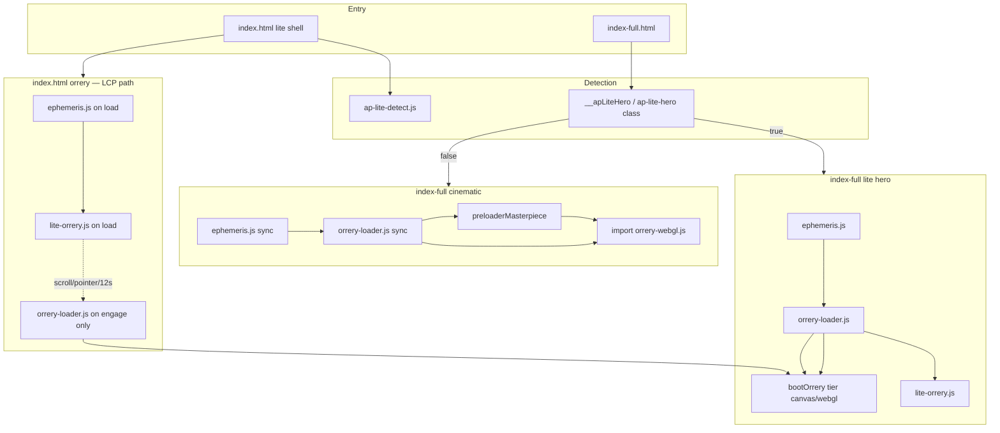
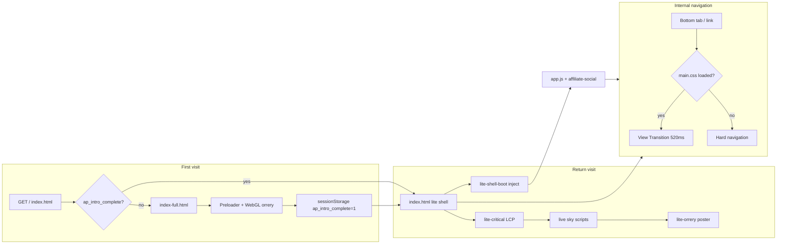

# AstroPrecise — Page Flow & Rendering Audit

**Date:** 2026-06-16  
**Scope:** `website/` — 45 HTML files, entry paths, CSS tiers, navigation, orrery boot, transitions, affiliate/social gaps  
**SW version:** `ap-v300` (`sw.js`)

---

## Executive summary

The site uses a **two-entry homepage** (`index.html` 7KB lite shell → `index-full.html` cinematic first visit) with **three CSS tiers** (`lite-critical` → `main-lite` + deferred `main.css` → blocking `main.css`). Core tools (chart, horoscope, shop) are on the perf tier; **27 editorial/tool pages** still load full blocking `main.css`. **View Transitions** (`@view-transition` in `main.css` only) are inactive on `main-lite` pages until `deferMainCss()` fires. **`affiliate-social.js`** loads only via `app.js` — absent on lite shell first paint, legal pages, redirects, and outreach.

---

## 1. Entry paths: `index.html` → `index-full.html`

### Redirect chain (`index.html` head)

```
ap-lite-detect.js  →  inline redirect IIFE
```

| Condition | Destination |
|-----------|-------------|
| `__apStayOnLiteShell()` — `webdriver`, `HeadlessChrome`, or `?lite=1` / `?nosplash=1` | Stay on `index.html` |
| `?full=1` | `location.replace('index-full.html' + query + hash)` |
| `sessionStorage.ap_intro_complete !== '1'` | `index-full.html` (first-visit cinematic) |
| Else (return visit) | Stay on lite shell |

**Files:** `index.html` (L5–21), `js/ap-lite-detect.js`

### `index-full.html` lite-hero gate (inverse)

`liteHeroActive()` adds `ap-lite-hero` when:

- `?lite=1` / `?nosplash=1`
- `navigator.webdriver`
- `prefers-reduced-motion: reduce`
- `connection.saveData`

**Explicitly excluded** from lite-hero: `deviceMemory`, `hardwareConcurrency`, `ap_intro_complete` — so desktop return visits to `index-full.html?full=1` still get preloader + WebGL path.

**Files:** `index-full.html` (L5–26)

### Progressive inject (`lite-shell-boot.js`)

On `index.html` only (`window.__apLiteShell`):

1. **Trigger:** scroll, pointerdown, or 15s timeout (after `load`)
2. **CSS:** inject `main.css`, `orrery-visual.css`, `landing-gate.css`, `index-home.css`, `fonts.css`
3. **HTML:** `fetch('index-full.html')` → slice after `<!-- ap-below-hero -->` → strip `.features-section`, `#how-it-works`, `.manifesto-section` → inject into `#ap-lite-rest`
4. **JS chain:** `raf-core.js` → … → `app.js` → `effects.js` (sequential defer)
5. **Skipped** when `__apSkipOrreryBoot()` (audit / `?lite=1`)

**Gap (residual):** Below-fold home slice + full `effects.js` chain still scroll/2.5s-gated; chrome (`app.js`, bottom nav) at `load+800ms` since ap-v404.

---

## 2. Shell tiers by page

### Tier definitions

| Tier | Blocking CSS | Deferred | `app.js` | View transitions |
|------|--------------|----------|----------|------------------|
| **A — Lite entry** | `lite-critical.css` (+ seals, forms on shell) | Full stack via `lite-shell-boot.js` | After inject | No (until `main.css`) |
| **B — Home full** | `lite-critical.css` | `apStyleBoot()` idle → `main.css` stack | `defer` in body | Lite path: delayed |
| **C — Perf tools** | `main-lite.css` + `*-critical.css` | `deferMainCss()` + page CSS | `defer` or sync | Delayed until interaction/idle |
| **D — Hybrid** | `main.css` **blocking** + critical slice | Page CSS only (no `deferMainCss`) | `defer` | Immediate |
| **E — Legacy** | `main.css` + blocking `fonts.css` | None | sync `app.js` | Immediate |
| **F — Minimal** | Inline / fonts only | N/A | None | None |
| **G — Dev** | Inline | N/A | None | N/A |

### Page tier table (all 45 HTML files)

| File | Tier | Blocking CSS | `defer-page-css` | `app.js` | Notes |
|------|------|--------------|------------------|----------|-------|
| `index.html` | A | `lite-critical`, `celestial-seals`, `ap-forms` | — | After inject | 7KB shell; static nav |
| `index-full.html` | B | `lite-critical` | `apStyleBoot()` inline | `defer` | Preloader + orrery cinematic |
| `index-lite.html` | F | — | — | — | Redirect → `index.html` |
| `chart.html` | C | `main-lite`, `chart-critical`, `ap-forms` | ✓ `deferMainCss` + chart CSS | `defer` | Perf reference |
| `horoscope.html` | C | `main-lite`, `horoscope-critical`, `ap-forms` | ✓ | `defer` | |
| `shop.html` | C | `main-lite`, `shop-critical` | ✓ + `shop.css` | Via `shop-page-boot.js` | No direct `app.js` tag |
| `ephemeris.html` | C | `main-lite`, `ephemeris-page`, `ap-forms` | ✓ `deferMainCss` | sync | |
| `lifepath.html` | C | `main-lite`, `lifepath-page` | ✓ | sync | |
| `transits.html` | C | `main-lite`, `transits-page`, `ap-forms` | ✓ | sync | |
| `compatibility.html` | **D** | **`main.css` blocking**, `compatibility-critical` | Partial — **no `deferMainCss`** | `defer` | Outlier among core tabs |
| `accuracy.html` | E | `main.css`, `chart.css` | — | sync | |
| `angel-numbers.html` | E | `main.css` | — | sync | |
| `aquarius.html` | E | `main.css` | — | sync | Sign template |
| `aries.html` | E | `main.css` | — | sync | Sign template |
| `cancer.html` | E | `main.css` | — | sync | Sign template |
| `capricorn.html` | E | `main.css` | — | sync | Sign template |
| `gemini.html` | E | `main.css` | — | sync | Sign template |
| `leo.html` | E | `main.css` | — | sync | Sign template |
| `libra.html` | E | `main.css` | — | sync | Sign template |
| `pisces.html` | E | `main.css` | — | sync | Sign template |
| `sagittarius.html` | E | `main.css` | — | sync | Sign template |
| `scorpio.html` | E | `main.css` | — | sync | Sign template |
| `taurus.html` | E | `main.css` | — | sync | Sign template |
| `virgo.html` | E | `main.css` | — | sync | Sign template |
| `charts.html` | E | `main.css` | — | sync | |
| `links.html` | E | `main.css` | — | sync | |
| `moonphase.html` | E | `main.css` | — | sync | |
| `name-numerology.html` | E | `main.css` | — | sync | |
| `profile.html` | E | `main.css` | — | sync | Large inline CSS |
| `quiz.html` | E | `main.css` | — | sync | |
| `retrograde.html` | E | `main.css` | — | sync | |
| `saturn-return.html` | E | `main.css` | — | sync | |
| `solar-return.html` | E | `main.css` | — | sync | |
| `synastry.html` | E | `main.css` | — | sync | |
| `tonight.html` | E | `main.css` | — | sync | |
| `what-is-my-rising-sign.html` | E | `main.css` | — | sync | |
| `why.html` | E | `main.css` + scoped inline | — | sync | |
| `privacy.html` | F | `fonts.css` + inline | — | — | |
| `terms.html` | F | `fonts.css` + inline | — | — | |
| `404.html` | F | `fonts.css` + inline | — | — | |
| `sample-reading.html` | F | Google Fonts + inline | — | — | |
| `fulfil-redirect.html` | F | Inline | — | — | Typeform redirect |
| `outreach.html` | F+ | `main.css` | — | — | `outreach-content.js` only |
| `phone-cosmic-viewer.html` | G | Inline | — | — | LAN iframe probe |
| `phone-audit.html` | G | Inline + axe CDN | — | — | A11y probe |

**Counts:** A=1, B=1, C=6, D=1, E=27, F=7, G=2 → **45**

---

## 3. Navigation (`app.js`)

### IA constants (single source of truth)

```javascript
NAV_PRIMARY:     index, chart, horoscope, compatibility, ephemeris
NAV_MORE_EXPLORE: lifepath, transits, why, shop
NAV_EXTRAS:      accuracy, charts, quiz, tonight, moonphase, retrograde, …
NAV_BOTTOM_TABS: index, chart, horoscope, compatibility  (4 tabs + Updates pin)
```

**File:** `js/app.js` L116–142

### How pages link

| Mechanism | Behavior |
|-----------|----------|
| `renderNav()` | Fills `.navbar__nav` + mobile drawer from `NAV_*` on every page with empty nav placeholder |
| `injectBottomNav()` | Injects `.bottom-nav` if absent; sets `--bottom-nav-h` |
| Lite `index.html` | Static `NAV_PRIMARY` + More drawer; `app.js` hydrates at `load+800ms` |
| Bottom tab active state | Pathname match on `href` |
| Shop | In `NAV_MORE_EXPLORE`, not bottom tabs — discoverability via drawer / lite rail |

### Nav / shell mismatches (post Wave 20)

| Location | Issue |
|----------|-------|
| `index.html` | ✅ Primaries + Sky bottom tab aligned with `ap-nav-model.js` |
| `index.html` | Shop / transits discoverable via More drawer + lite rail (not bottom tabs — by design) |
| `NAV_BOTTOM_TABS` | Home / Chart / Daily / Sky — Match omitted (drawer) |

---

## 4. Orrery boot chain

### Component roles

| Module | Role |
|--------|------|
| `js/ephemeris.js` | VSOP87 JD / positions — shared dependency |
| `js/lite-orrery.js` | Canvas poster, micro-journey, lite deck; gates on `__apLiteHero` |
| `js/orrery-loader.js` | Schedules `import('orrery-webgl.js')`, tier boot (canvas vs WebGL), launch button |
| `js/orrery-webgl.js` | Three.js module; registers `window.Orrery3D` |
| `js/orrery3d.js` | Canvas2D fallback when WebGL path fails |

### Boot paths



### Engage triggers (WebGL upgrade)

- Scroll / pointerdown / 12–15s timeout
- `#orrery-lite-launch` click
- `?full=1` on `index-full.html`

### Audit / lite query behavior

- `__apSkipOrreryBoot()`: skips `lite-shell-boot` orrery path; `index-full` delays orrery scripts 35s under `webdriver`
- `defer-page-css.js` + audits: skip deferred CSS when `webdriver` or `?lite=1`

### `index.html` vs `index-full` lite chain (Wave 21)

| Aspect | `index.html` (return-visit shell) | `index-full` (`__apLiteHero`) |
|--------|-----------------------------------|-------------------------------|
| On `load` | `ephemeris` → `lite-orrery` (poster LCP) | `ephemeris` → `orrery-loader` → `lite-orrery` |
| `orrery-loader.js` | **Engage only** (scroll / pointer / launch / 12s) | On `load` (schedules idle/intersection tier boot) |
| `ephemeris.js` | `apSkyDockBoot` seq on `load`; `apLiteJsBoot` reuses `AstroEphemeris` | First in `LITE_ORRERY` seq |
| `modulepreload` | None in HTML — inject on `load`; WebGL `modulepreload` from `lite-orrery.js` idle | N/A (same ephemeris inject) |
| **Status** | **Deferred (LCP)** — won't eager-load loader (Wave 20: ~1.5s LCP regression) | Canonical for cinematic / `?lite=1` on full page |

**Files:** `index.html` (orrery boot comment + `apSkyDockBoot` / `apLiteJsBoot`), `index-full.html` L1650–1677

**SW precache:** `ephemeris.js`, `orrery-loader.js`, `lite-orrery.js` — **not** `orrery-webgl.js` (runtime `import()`)

---

## 5. View transitions & cross-page smoothing

| Source | Rule |
|--------|------|
| `css/main.css` L5708+ | `@view-transition { navigation: auto; }`, root cross-fade 520ms, `site-sigil` shared element |
| `css/main-lite.css` | **No** `@view-transition` |
| `css/lite-critical.css` | **No** view transitions |

**Documented intent** (chart/horoscope comments): internal pages rely on View Transitions cross-fade; homepage intro is session-gated.

**Broken / weak transitions:**

1. **main-lite → main-lite:** No transition until `deferMainCss()` loads `main.css` (scroll/pointer/12s idle)
2. **lite shell → tool page:** Shell has no `main.css`; first navigation is hard cut
3. **legacy main.css → main-lite:** Asymmetric — outgoing has transitions, incoming may not until defer
4. **Sigil morph:** Logo `view-transition-name` only active when `main.css` loaded

---

## 6. `affiliate-social.js` coverage

Loaded at tail of `app.js` (dynamic script inject) — **not** a static `<script>` in HTML.

| Capability | Requires |
|------------|----------|
| Footer social icons | `app.js` → `affiliate-social.js` |
| Affiliate ad strip | `app.js` + `AP_MON.affiliate` + page in `affiliate.pages` default list |

**Default ad pages:** `index.html`, `chart.html`, `horoscope.html`, `compatibility.html`, `transits.html`, `lifepath.html`  
**File:** `js/affiliate-social.js` L152–158

### Pages missing `affiliate-social` (no `app.js` on first paint)

| Page | Impact |
|------|--------|
| `index.html` (pre-inject) | No social row / ads until scroll inject |
| `privacy.html`, `terms.html`, `404.html` | No footer social |
| `fulfil-redirect.html`, `index-lite.html` | Redirect only |
| `outreach.html` | No `app.js` |
| `phone-*.html` | Dev tools |
| `shop.html` | Delayed until `shop-page-boot.js` chain reaches `app.js` |

---

## 7. Service worker precache gaps

**Version:** `ap-v300`

| Precached | Missing from PRECACHE (notable) |
|-----------|----------------------------------|
| `index.html`, `index-full.html`, core tools | `css/shop-critical.css` |
| `main.css`, `main-lite.css`, `lite-critical.css` | `js/orrery-webgl.js`, `js/vendor/three/*` |
| `defer-page-css.js`, orrery lite chain | `js/shop-page-boot.js` |
| `affiliate-social.js` | `phone-cosmic-viewer.html`, `phone-audit.html`, `fulfil-redirect.html` (intentional) |

Offline shop first paint may lack `shop-critical.css` until network fetch.

---

## 8. Transition diagram (full user journey)



---

## 9. Top 10 gaps (ranked by impact)

| Rank | Gap | Impact | Evidence |
|------|-----|--------|----------|
| **1** | ~~View Transitions inactive on perf-tier pages at navigation time~~ → **chart/compat bridge still idle on first paint** (Wave 19) | Jarring cuts between core tools on first same-origin nav | ✅ `@view-transition` in `main-lite.css` + blocking `ap-page-bridge.css` on shop/ephemeris; chart/compat moved to blocking bridge **ap-v399** |
| **~~2~~** | ~~`compatibility.html` uses blocking `main.css` while sibling tabs use `main-lite`~~ | ~~Bottom-tab LCP regression~~ | ✅ `main-lite` + `deferMainCss()` since ap-v370; CLS **0** |
| **~~3~~** | ~~27 legacy pages on blocking `main.css` + blocking `fonts.css`~~ | ~~Slow first paint on SEO long-tail~~ | ✅ Batch `migrate-legacy-to-main-lite.mjs` — editorial/tool/sign pages on `main-lite` + deferred fonts (noscript fallback only) |
| **~~4~~** | ~~`index.html` static nav ≠ `NAV_PRIMARY`~~ | ~~IA drift until inject~~ | ✅ Wave 20 / **ap-v404** — static primaries (Home/Chart/Daily/Match/Sky) + `navbar__more` + bottom-tab placeholder |
| **~~5~~** | ~~Lite shell: delayed `app.js` / affiliate / bottom nav~~ | ~~Bounce without chrome~~ | ✅ Wave 20 / **ap-v404** — `lite-shell-boot.js` chrome at `load+800ms` (`app.js` + `ap-page-bridge`); rest at scroll/2.5s |
| **~~6~~** | ~~Asymmetric CSS tier transitions (lite shell ↔ tools)~~ | ~~Hard-cut first nav~~ | ✅ Wave 20 — blocking `ap-page-bridge.css` on core tools; shell defers `main.css` until engage (acceptable trade) |
| **~~7~~** | ~~SW omits `shop-critical.css`~~ | ~~Offline shop layout flash~~ | ✅ `shop-critical.css` in `sw.js` PRECACHE (ap-v399) |
| **~~8~~** | ~~`ephemeris.html` in NAV as "Sky" but bottom tabs omit it~~ | ~~Discoverability friction~~ | ✅ `NAV_BOTTOM_TABS` = Home/Chart/Daily/**Sky** (`js/ap-nav-model.js`) |
| **9** | ~~`index.html` orrery boot differs from `index-full` lite chain~~ → **Deferred (LCP)** | Loader order drift by design | Wave 21: won't eager-load `orrery-loader.js` on shell (perf 100 / LCP ~1.5s); documented in `index.html` comment + §4 |
| **~~10~~** | ~~Legal/minimal pages lack shared footer social~~ | ~~Brand consistency on privacy/terms/404~~ | ✅ `js/footer-chrome.js` on `privacy.html`, `terms.html`, `404.html` |

---

## 10. Concrete fix list

| Priority | Fix | File(s) | Status |
|----------|-----|---------|--------|
| ~~P0~~ | ~~Move `@view-transition` rules into `main-lite.css`~~ | `tools/build-main-lite.mjs` → `css/main-lite.css` | ✅ ap-v395 |
| ~~P0~~ | ~~Migrate `compatibility.html` to `main-lite` + `deferMainCss()`~~ | `compatibility.html` | ✅ ap-v370+ |
| ~~P0~~ | ~~Blocking `ap-page-bridge.css` on chart + compat (first-nav VT)~~ | `chart.html`, `compatibility.html` | ✅ ap-v399 |
| ~~P1~~ | ~~Batch-convert tier E sign pages to `main-lite` + deferred fonts~~ | `tools/migrate-legacy-to-main-lite.mjs`, `generate-sign-pages.mjs` | ✅ ap-v313+ |
| ~~P1~~ | ~~Align `index.html` interactive navbar with `NAV_PRIMARY` before scroll inject~~ | `index.html`, `js/lite-shell-boot.js` | ✅ ap-v404 (static nav + drawer primaries) |
| ~~P1~~ | ~~Eager-load `app.js` on lite shell after `load` for bottom nav + affiliate~~ | `js/lite-shell-boot.js` — chrome at `load+800ms`, rest at 2.5s | ✅ ap-v404 |
| ~~P2~~ | ~~Add `css/shop-critical.css` to SW `PRECACHE`~~ | `sw.js` | ✅ ap-v399 |
| ~~P2~~ | ~~Add `ephemeris.html` to bottom tabs~~ | `js/ap-nav-model.js` `NAV_BOTTOM_TABS` | ✅ ap-v395 |
| ~~P2~~ | ~~Unify lite orrery boot: same script order as `index-full`~~ | `index.html` `apLiteJsBoot` | **Deferred (LCP)** — Wave 21; engage-gated loader documented; no eager `orrery-loader.js` |
| ~~P3~~ | ~~Footer social on legal/minimal pages~~ | `js/footer-chrome.js` | ✅ ap-v395 |
| ~~P3~~ | ~~Extend `affiliate.pages` default to include `shop.html`, `ephemeris.html`~~ | `js/affiliate-social.js` | ✅ ap-v404 |
| ~~P3~~ | ~~Migrate `tonight.html`, `quiz.html`, `profile.html` to tier C pattern~~ | Per-page heads + critical CSS slices | ✅ main-lite batch |

---

## 11. Key file reference

| Concern | Path |
|---------|------|
| Lite redirect detect | `js/ap-lite-detect.js` |
| Progressive home inject | `js/lite-shell-boot.js` |
| CSS defer helper | `js/defer-page-css.js` |
| Nav IA | `js/app.js` (`NAV_*`, `renderNav`, `injectBottomNav`) |
| Affiliate / social | `js/affiliate-social.js` (via `app.js` L2187–2195) |
| Orrery loader | `js/orrery-loader.js` |
| Lite poster | `js/lite-orrery.js` |
| WebGL engine | `js/orrery-webgl.js` |
| Shop deferred JS | `js/shop-page-boot.js` |
| SW precache | `sw.js` `PRECACHE` L9–223 |
| View transitions | `css/main.css` ~L5708 |

---

*Generated by page-flow audit — AstroPrecise `website/tools/audit/`*